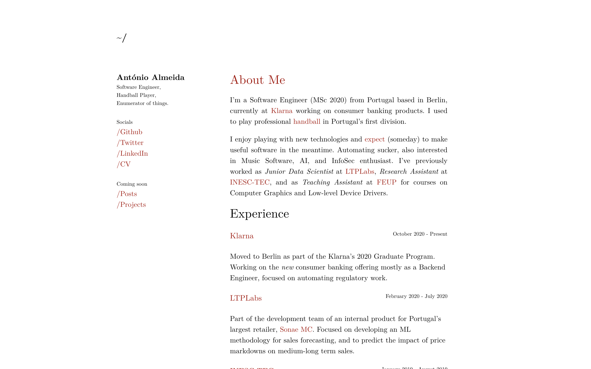
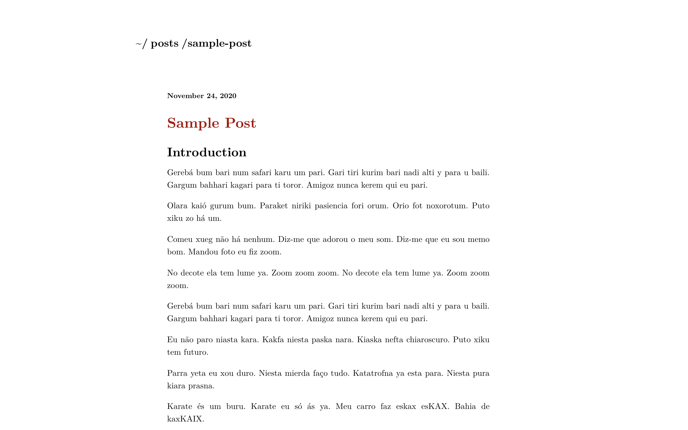

# Tex(h)ugo 🦡

Minimalistic website theme for [Hugo](https://gohugo.io/) based [Tex](https://en.wikipedia.org/wiki/TeX)'s typography. Live preview available [here](https://antonioalmeida.github.io)
 


| Home             |  Post |
:-------------------------:|:-------------------------:
  |  

## Getting Started

Clone this repository inside your Hugo project theme directory.

```shell
mkdir themes
cd themes
git clone https://github.com/antonioalmeida/tex-hugo-theme.git
```

## Configuration

Take a look at the [/exampleSite](https://github.com/antonioalmeida/antonioalmeida.github.io) directory.

Copy the `config.toml` to the root directory of your website and overwrite the existing information as needed.

__[config.toml](https://github.com/antonioalmeida/tex-hugo-theme/blob/master/exampleSite/config.toml)__:

```toml
baseurl = "https://example.com"
languageCode = "en"
title = "Texugo"
theme = "tex-hugo-theme"
copyright = "&copy; John Doe 2020
googleAnalytics = ""

[params]
    nickname = "johndoe"
    name = "John Doe"
    bio = ["Human being", "Not an animal", "a third thing"]

[[params.social]]
  name = "Github"
  url = "https://example.com"

[[params.social]]
  name = "Twitter"
  url = "https://example.com"

[[params.social]]
  name = "LinkedIn"
  url = "https://example.com"

[markup]
  [markup.highlight]
    codeFences = true
    guessSyntax = false
    hl_Lines = ""
    lineNoStart = 1
    lineNos = false
    lineNumbersInTable = true
    noClasses = true
    style = "github"
    tabWidth = 4
```

## Development

```shell
# run local server (localhost:1313)
$ hugo server


# make production build (/public)
$ hugo --minified
```

**Tip:** Check [this repository](https://github.com/antonioalmeida/antonioalmeida.github.io/blob/master/.github/workflows/gh-pages.yml) as an example on how to deploy via Github Actions.

## Inspired by
- [Tex](https://en.wikipedia.org/wiki/TeX)
- [WiTex](https://github.com/AndrewBelt/WiTeX)
- [Charaka](https://github.com/natarajmb/charaka-hugo-theme)

## Tweaking the theme
- Set up and activate as your website's theme
- Inside the theme directory install dependencies: `$ npm install`
- Make required changes to `style.scss` and run `$ npm run css-build && npm run css-watch` to live update your changes

## License

`tex-hugo-theme` is licensed under the [MIT License](LICENSE.md).

## Author

[António Almeida](https://github.com/antonioalmeida)
